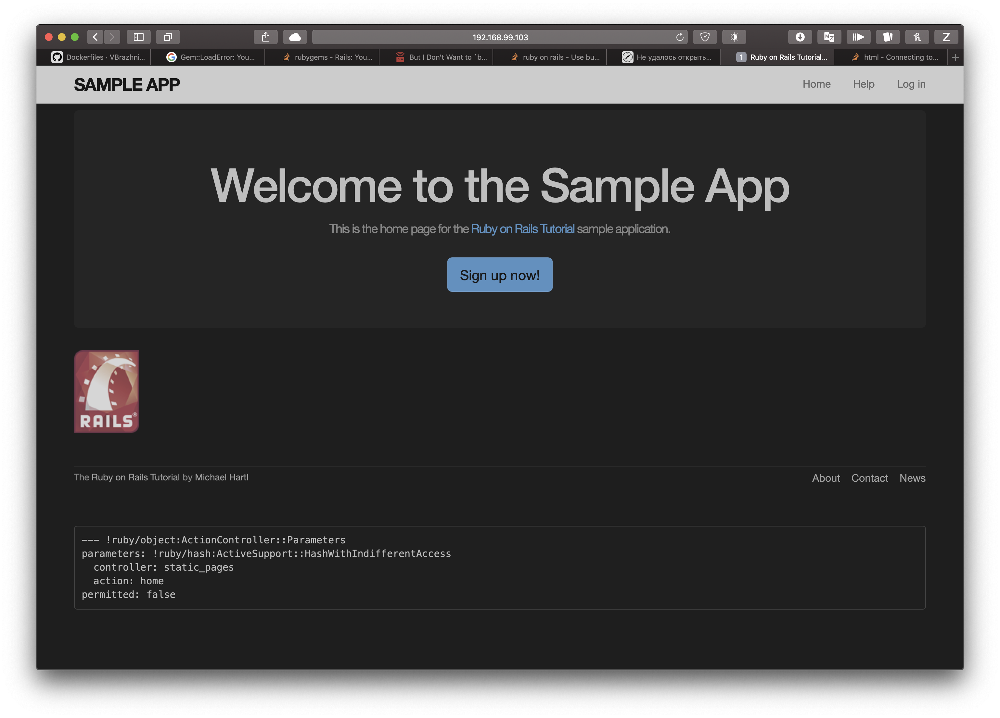
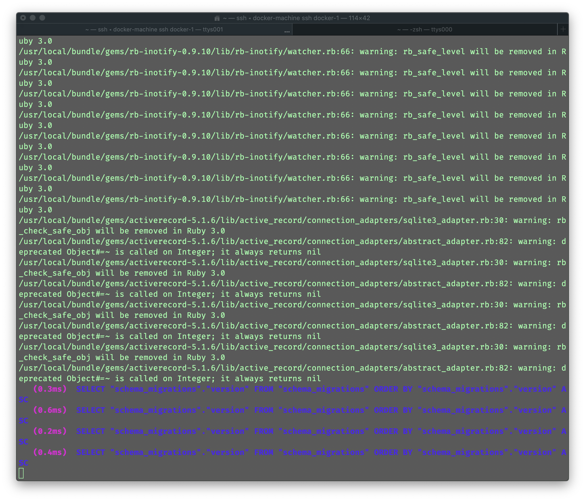

You are going to create your first Dockerfile to containerize Rails applications. 

>   Вы создадите ваш первый Dockerfile для контэйнеризации приложения на Рельсах.

That’s a special configuration: this particular Dockerfile will be generic, and called in another Dockerfile, that will look something like this:

>   Это особая конфигурация: этот конкретный Dockerfile будет основным, и вызывает другой Dockerfile:

```bash
FROM ft-rails:on-build
EXPOSE 3000
CMD ["rails", "s", "-b", "0.0.0.0", "-p", "3000"]
```

Your generic container should install, via a ruby container, all the necessary dependencies and gems, then **copy your rails application** in the /opt/app folder of your container. 

>   Ваш основной контейнер должен устанавливаться, через ruby контейнер, все необходимые зависимости и темы, после чего скопируйте ваше rails application в /opt/app вашего контейнера.

Docker has to install the approtiate gems when it builds, but also launch the migrations and the db population for your application. 

>   Докер должен устанавливать необходимые темы когда собирает приложение, но также запускать миграцию и наполняет базу данных для вашего приложения.

The child Dockerfile should launch the rails server (see example below). 

>   Дочерний докер файл должен запускать rails сервер.

If you don’t know what commands to use, it’s high time to look at the Ruby on Rails documentation.





