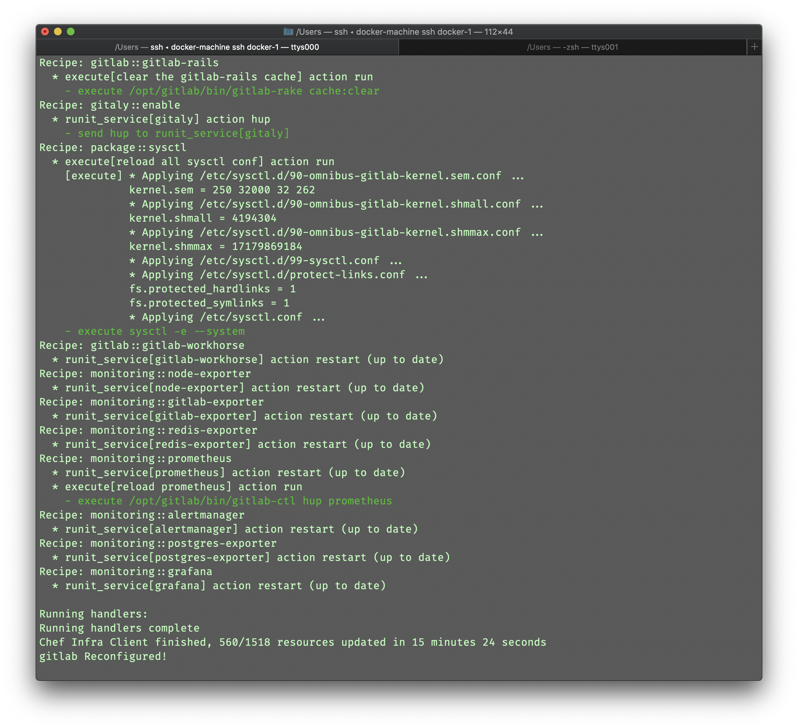
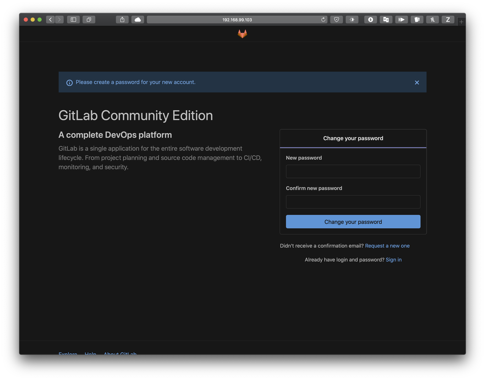
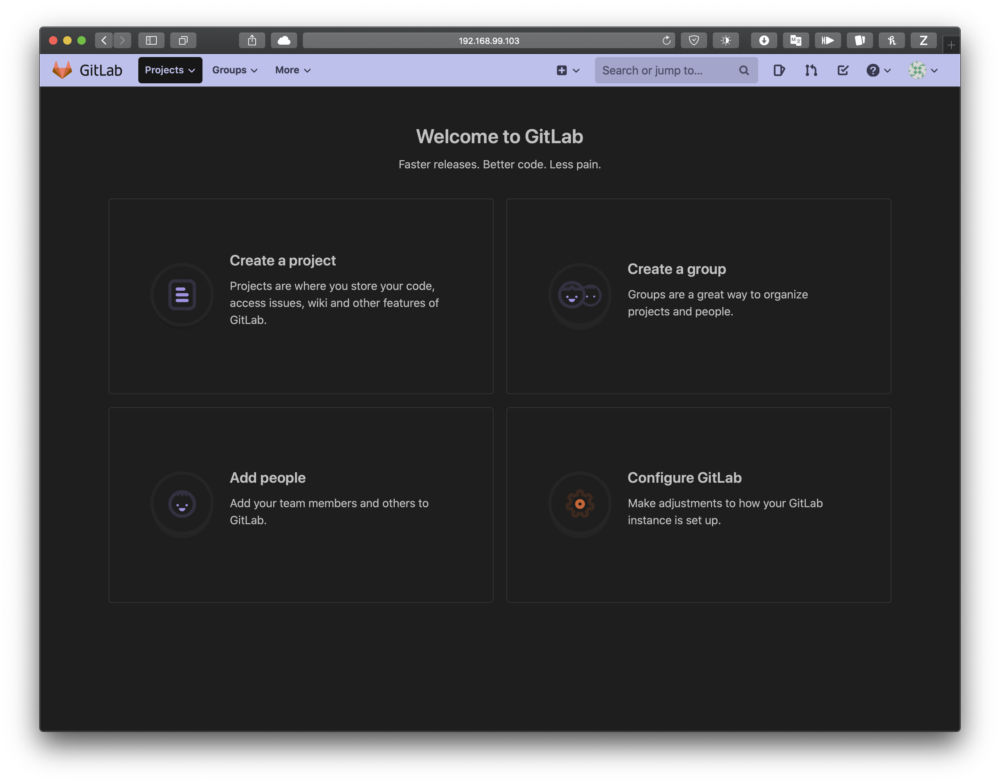
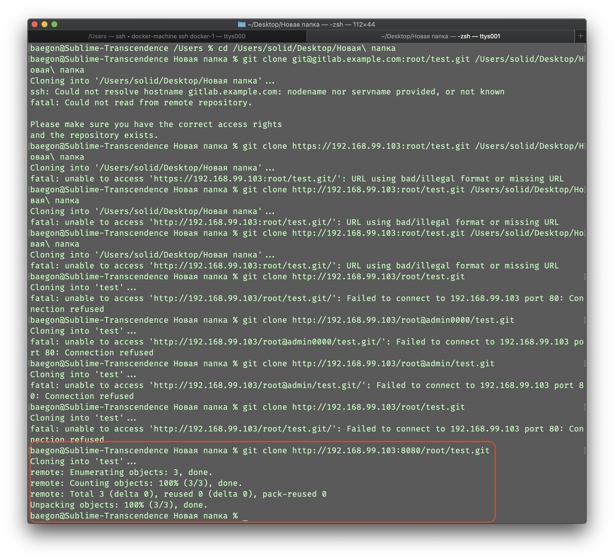

# Exercise 03: ... and bacon strips ... and bacon strips ...

| Exercise 03: | ... and bacon strips ... |
| ---- | ----- |
| Turn-in directory : | ex03/ |
| Files to turn in : | Dockerfile |
| Allowed functions : | -    |
| Notes : | n/a  |

Docker can be useful to test an application that’s still being developed without polluting your libraries. 

You will have to design a Dockerfile that gets the development version of Gitlab - Community Edition installs it with all the dependencies and the necessary configurations, and launches the application, all as it builds. 

The container will be deemed valid if you can access the web client, create users and interact via GIT with this container (HTTPS and SSH). 

Obviously, you are not allowed to use the official container from Gitlab, it would be a shame...

