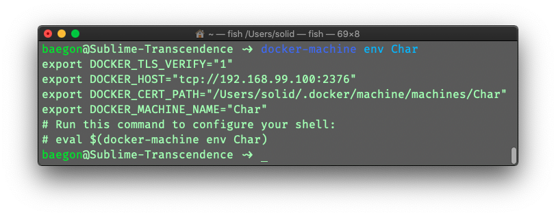

# DOCKER-1

#docker #admin

[[_TOC_]]


# Install

## docker-machine
* [инструкция по установке](https://docs.docker.com/machine/install-machine/)
```bash
$ base=https://github.com/docker/machine/releases/download/v0.16.0 &&
  curl -L $base/docker-machine-$(uname -s)-$(uname -m) >/usr/local/bin/docker-machine &&
  chmod +x /usr/local/bin/docker-machine
```

```bash
$ docker-machine version
```

## else
В се остальное уже было установлено и версси были последнии

# 00 how to docker

>   For each exercise, we will ask you to give the shell command(s) to:


## 01. Create a virtual machine with docker-machine using the virtualbox driver, and named Char.


```bash
docker-machine create --driver virtualbox Char
```


Подключение к docker-machine

```bash
docker-machine ssh Char
```

или

```bash
docker-machine ls
```


```bash
ssh docker@192.168.99.100
```

*   пароль по умолчанию: `tuser`


## 02. Get the IP address of the Char virtual machine.

```bash
docker-machine ip Char
```


## 03. Define the variables needed by your virtual machine Char in the general env of your terminal, so that you can run the docker ps command without errors. You have to fix all four environment variables with one command, and you are not allowed to use your shell’s builtin to set these variables by hand.

```bash
docker-machine env Char
```



Ответ:

```bash
eval $(docker-machine env Char)
```

Проверить:

```bash
docker-machine ls
```


>   Все последующие команды выполняются в `docker-machine`!

## 04. Get the hello-world container from the Docker Hub, where it’s available.

```bash
docker pull hello-world
```


## 05. Launch the hello-world container, and make sure that it prints its welcome message, then leaves it.

```bash
docker run hello-world
```


## 06. Launch an nginx container, available on Docker Hub, as a background task. It should be named overlord, be able to restart on its own, and have its 80 port attached to the 5000 port of Char. You can check that your container functions properly by visiting http://<ip-de-char>:5000 on your web browser.


```bash
docker run \
--detach \
--publish 5000:80 \
--name overlord \
--restart=always \
nginx
```


## 07. Get the internal IP address of the overlord container without starting its shell and in one command.

*   [How to Get A Docker Container IP Address - Explained with Examples](https://www.freecodecamp.org/news/how-to-get-a-docker-container-ip-address-explained-with-examples/)

```bash
docker inspect -f '{{.NetworkSettings.IPAddress}}' overlord
```


## 08. Launch a shell from an alpine container, and make sure that you can interact directly with the container via your terminal, and that the container deletes itself once the shell’s execution is done.

```bash
docker run -it --rm alpine /bin/sh
```

| flag | completely | annotation |
| :--- | ---- | ---- |
| -t  | --tty  | Allocate a pseudo-TTY |
| -i | --interactive  | Keep STDIN open even if not attached |
| | —rm | Automatically remove the container when it exits |


## 09. From the shell of a debian container, install via the container’s package manager everything you need to compile C source code and push it onto a git repo (of course, make sure before that the package manager and the packages already in the container are updated). For this exercise, you should only specify the commands to be run directly in the container.

Для запуска контейнера:

```bash
docker run -it debian /bin/sh
```

Для компиляции, запуска и работы с репозиторием:

```bash
apt-get update
apt-get upgrade -y
apt-get install git -y
apt-get install gcc -y
#apt-get install build-essential -y
echo '
# include <stdio.h>

int main(void)
{
	printf("Hello World");
	return (0);
}
' > main.c
```


## 10. Create a volume named hatchery.


```bash
docker volume create hatchery
```


## 11. List all the Docker volumes created on the machine. Remember. VOLUMES.

```bash
docker volume ls
```


## 12. Launch a mysql container as a background task. It should be able to restart on its own in case of error, and the root password of the database should be Kerrigan. You will also make sure that the database is stored in the hatchery volume, that the container directly creates a database named zerglings, and that the container itself is named spawning-pool.


```bash
docker run \
--detach \
--name spawning-pool \
--restart=on-failure \
-v hatchery:/var/lib/mysql \
-e MYSQL_ROOT_PASSWORD=Kerrigan \
-e MYSQL_DATABASE=zerglings \
mysql \
--default-authentication-plugin=mysql_native_password
```

Хозяйке на заметку:

*   [DockerHub - mysql](https://hub.docker.com/_/mysql)
*   [How to Run MySQL 8.0 with Native Password Authentication](https://medium.com/@crmcmullen/how-to-run-mysql-8-0-with-native-password-authentication-502de5bac661)


## 13. Print the environment variables of the spawning-pool container in one command, to be sure that you have configured your container properly.


```bash
docker exec spawning-pool printenv
```

или:

```bash
docker inspect -f '{{.Config.Env}}' spawning-pool
```


## 14. Launch a wordpress container as a background task, just for fun. The container should be named lair, its 80 port should be bound to the 8080 port of the virtual machine, and it should be able to use the spawning-pool container as a database service. You can try to access lair on your machine via a web browser, with the IP address of the virtual machine as a URL.


```bash
docker run \
--detach \
--name lair \
--publish 8080:80 \
-e WORDPRESS_DB_HOST=$(docker inspect -f '{{.NetworkSettings.IPAddress}}' spawning-pool) \
-e WORDPRESS_DB_USER=root \
-e WORDPRESS_DB_PASSWORD=Kerrigan \
-e WORDPRESS_DB_NAME=zerglings \
wordpress
```

или, но это какая-то устаревшая магия:

```bash
docker run \
--detach \
--name lair \
--publish 8080:80 \
--link spawning-pool:mysql \
wordpress
```

Congratulations, you just deployed a functional Wordpress website in two com- mands!


## 15. Launch a phpmyadmin container as a background task. It should be named roach-warden, its 80 port should be bound to the 8081 port of the virtual machine and it should


```bash
docker run \
--detach \
--name roach-warden \
--publish 8081:80 \
-e MYSQL_USER=root \
-e MYSQL_PASSWORD=Kerrigan \
-e PMA_HOST=$(docker inspect -f '{{.NetworkSettings.IPAddress}}' spawning-pool) \
phpmyadmin/phpmyadmin
```

или:

```bash
docker run 
--detach \
--name roach-warden \
--link spawning-pool:db \
--publish 8081:80 \
phpmyadmin/phpmyadmin
```

be able to explore the database stored in the spawning-pool container.


## 16. Look up the spawning-pool container’s logs in real time without running its shell.

```bash
docker logs -f spawning-pool
```


## 17. Display all the currently active containers on the Char virtual machine.

```
docker ps
```

или

```
docker ps -f status=running
```


## 18. Relaunch the overlord container.

```bash
docker restart overlord
```


## 19. Launch a container name Abathur. It will be a Python container, 2-slim version, its /root folder will be bound to a HOME folder on your host, and its 3000 port will be bound to the 3000 port of your virtual machine. You will personalize this container so that you can use the Flask micro-framework in its latest version. You will make sure that an html page displaying "Hello World" with <h1> tags can be served by Flask. You will test that your container is properly set up by accessing, via curl or a web browser, the IP address of your virtual machine on the 3000 port. You will also list all the necessary commands in your repository.


Запустим контейнер:

```bash
docker run \
-d -i -t \
--name Abathur \
-p 3000:3000 \
-v ~/:/root \
python:2-slim
```

Установка Flask:

```bash
docker exec Abathur /usr/local/bin/python -m pip install --upgrade pip
docker exec Abathur pip install Flask
```

Создание приложения. Мы создаем его в `docker-machine` в папке:

```bash
echo '
from flask import Flask
app = Flask(__name__)

@app.route("/")
def hello_world():
    return "<h1>Hello World!</h1>"

if __name__ == "__main__":
    app.run()
' > hello.py
```

Запускаем:

```bash
docker exec -d -e FLASK_APP=/root/hello.py Abathur flask run --host=0.0.0.0 --port 3000
```

Проверяем в `docker-machine`:

```bash
curl $(docker inspect -f '{{.NetworkSettings.IPAddress}}' Abathur):3000
```

Или из вне:

```bash
curl $(docker-machine ip Char):3000
```


## 20. Create a local swarm, the Char virtual machine should be its manager.


Для запуска из терминала mac:

```bash
docker swarm init --advertise-addr $(docker-machine ip Char)
```

```bash
docker info
```

```bash
docker node ls
```


## 21. Create another virtual machine with docker-machine using the virtualbox driver, and name it Aiur.


```bash
docker-machine create --driver virtualbox Aiur
```


## 22. Turn Aiur into a slave of the local swarm in which Char is leader (the command to take control of Aiur is not requested).

```bash
docker-machine ssh Aiur $(docker-machine ssh Char docker swarm join-token worker | grep token)
```


## 23. Create an overlay-type internal network that you will name overmind. 


```bash
docker network create -d overlay overmind
```


##  24. Launch a rabbitmq SERVICE that will be named orbital-command. You should define a specific user and password for the RabbitMQ service, they can be whatever you want. This service will be on the overmind network.


```bash
docker service create \
-d \
--name orbital-command \
--network overmind \
-e RABBITMQ_DEFAULT_USER=scv \
-e RABBITMQ_DEFAULT_PASS=ready \
rabbitmq
```


## 25. List all the services of the local swarm.

```bash
docker service ls
```


## 26. Launch a 42school/engineering-bay service in two replicas and make sure that the service works properly (see the documentation provided at hub.docker.com). This service will be named engineering-bay and will be on the overmind network.


```bash
docker service create \
-d \
--name engineering-bay \
--network overmind \
--replicas 2 \
-e OC_USERNAME=scv \
-e OC_PASSWD=ready \
42school/engineering-bay
```


## 27. Get the real-time logs of one the tasks of the engineering-bay service.


```bash
docker service logs -f $(docker service ps engineering-bay -f desired-state=running -f name=engineering-bay.1 -q)
```


## 28. ... Damn it, a group of zergs is attacking orbital-command, and shutting down the engineering-bay service won’t help at all... You must send a group of Marines to eliminate the intruders. Launch a 42school/marine-squad in two replicas, and make sure that the service works properly (see the documentation provided at hub.docker.com). This service will be named... marines and will be on the overmind network.


```bash
docker service create \
-d \
--name marines \
--network overmind \
--replicas 2 \
-e OC_USERNAME=scv \
-e OC_PASSWD=ready \
42school/marine-squad
```

```bash
docker service logs -f $(docker service ps marines -f desired-state=running -f name=marines.1 -q)
```

## 29. Display all the tasks of the marines service.

```bash
docker service ps marines
```


## 30. Increase the number of copies of the marines service up to twenty, because there’s never enough Marines to eliminate Zergs. (Remember to take a look at the tasks and logs of the service, you’ll see, it’s fun.)

```bash
docker service scale -d marines=20 
```


## 31. Force quit and delete all the services on the local swarm, in one command.

```bash
docker service rm $(docker service ls -q)
```


## 32. Force quit and delete all the containers (whatever their status), in one command.

```bash
docker rm -f $(docker ps -a -q)
```


## 33. Delete all the container images stored on the Char virtual machine, in one command as well.

```bash
docker rmi $(docker images -a -q)
```


## 34. Delete the Aiur virtual machine without using rm -rf.

```bash
docker-machine rm -y Aiur
```

```bash
docker-machine rm -y Char
```

